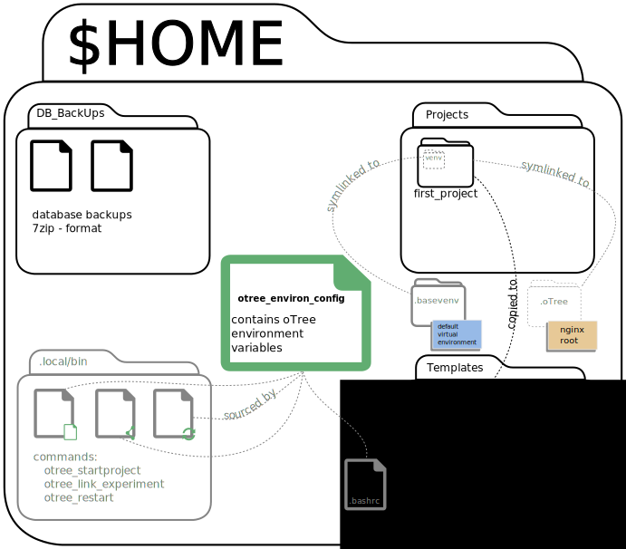

-----------------
End User Desktop
-----------------

Apart from the standard otree commands we created a set of commands for the end
user to improve usability. The commands are available via command line and via
desktop launcher providing an easy to use GUI that guides the user through the
several processes. The user has the following commands available:

* ``otree_startproject`` creates an otree project in the folder `Projects` in
  the user's home directory. The created folder is a basic otree project folder
  WITHOUT the example apps. It further creates either a symbolic link ``venv``
  to the default virtual python environment of the user in the project folder
  or creates a specific virtual environment within the project folder called
  ``venv``. The latter allows for specialized oTree versions for each project.
  Lastly it copies the `_rooms` directory from the folder Templates into the
  project folder. `_rooms` contains a preconfigured econ101.txt for 24 clients.

* ``otree_link_experiment`` is used to create a symbolic link to the nginx root
  location. The nginx webserver looks in a predefined location for a webserver
  root. The command handles the linking for you and creates a symlink to
  ``$HOME/.oTree`` which is where nginx looks for your project.

* ``otree_restart`` helps you with your starting requirements. It offer to run
  ``otree collectstatic`` for you  as well as an ``otree resetdb``. Before the
  database reset is executed pg_dump makes a backup of the current state of the
  database and stores a 7zipped version of it in $HOME/DB_BackUps. Finally it
  runs ``otree runprodserver --port=YOUR_DAPHNE_PORT`` or
  ``otree runserver YOUR_DAPHNE_PORT`` for you to ensure that
  you use the correct port. ``otree_restart`` also comes with a number of
  arguments that help you get started more quickly.

:-c: run ``otree collectstatic``
:-h: help
:-l: run local (programming) server (runserver)
:-m: Send emails when otree stops running.
   (Your email is configured in `otree_environ_config`.)
:-p: skip queries and run ``otree runprodserver --port=YOUR_PORT`` directly
:-r: run ``otree resetdb``
:-s: start otree in a detached screen (virtual console)

The commands are stored in $HOME/.local/bin for each user separately so that
users can make adjustments for themselves if needed.

All three commands offer a console and a GUI based on GTK zenity dialogs.
For calling the GUI three ``*.desktop`` are created in $HOME/Desktop.

When you call up a command the command will guide you through the process.

The below graphic provides an overview of the file structure created in the
oTree user's home directory and the command relations.

The user should not run ``otree runserver`` (which is just for local testing)
or ``otree runprodserver`` (because of the proxy settings).

.. _starting_project:

Starting a new Project as End User
----------------------------------

You need to complete 2 steps in order start a new project and connect it to
the server root directory.

**Step 1)**

1. Execute ``otree_startproject``

2. Provide a project name.

3. Choose whether to create a **specialized virtual environment** for this
   project.

**Step 2)**

1. Execute ``otree_link_experiment``

2. Select the path to the project you want to run.

.. _running_experiments:

Running Experiments as End User
-------------------------------

As End User you have to follow the following steps in order to run
experiments.

1. Execute ``otree_restart``

2. Choose whether to do a collect static or not.

3. Choose whether to do a database reset.

4. Watch the output if everything starts fine. ;-)

If you have trouble starting the experiment or you want to activate demo mode
change the necessary parameters in the ``otree_environ_config``.
``otree_restart`` sources ``otree_environ_config`` each time it is called. You
don't need to manually source it to activate the new settings.

