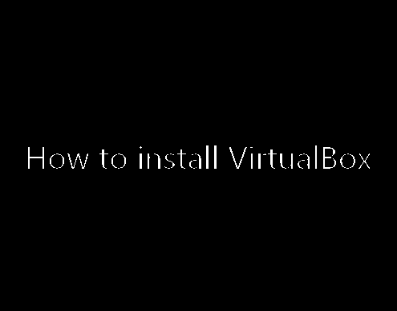
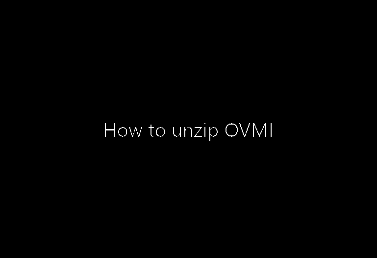

.. _ovmi_installation:

Installation
============

The following steps will guide you through the installation process and at the
end you are able to run your experiment in OMVI.

VirtualBox
----------

The first component we need to install is Oracle's VirtualBox. This piece of
software lets you run the OS inside the virtual machine on your computer.

First, go to `download page`_ and click on the link belonging to your operating
system. The setup file will be downloaded.

.. _download page: https://www.virtualbox.org/wiki/Downloads

Second, execute the installer and let all boxes checked or unchecked as they
are. A short video shows the installation process

OVMI
----

You can download the image from the cloud servers of University of Bonn by
following this `download link`_.

.. _download link: https://uni-bonn.sciebo.de/index.php/s/0W9NFn2WfFSidx6

Note that you download a ZIP archive with a size of approximately 10GB. Make
sure that you have enough space available on your machine.

After the download, you need to unzip the folder which requires additional 11GB
of space. The extraction is easily done within the context menu.

Configuring VirtualBox with OVMI
--------------------------------

We have to add OMVI to VirtualBox and set the network configuration. We want to
have access to the web from within the virtual machine and we would like to
have a connection between your base OS (the host) and the OS inside the virtual
machine (the guest). The last step allows us to quickly transfer files into and
out of the virtual machine.

1. Start VirtualBox.
2. Select *Machine* from the top menu and choose *Add*. In the opening file
   manager, navigate to the extracted folder and select *otree-lxle.vbox*.
   After opening the file, an item called *otree-lxle* will be shown in a list
   on the left side of VirtualBox.
3.

- show how to set up an internet connection for your vm and a connection
  between host and guest
  - https://serverfault.com/questions/225155/virtualbox-how-to-set-up-networking-so-both-host-and-guest-can-access-internet
  - https://gist.github.com/odan/48fc744434ec6566ca9f7a993f4a7ffb
- make videos
