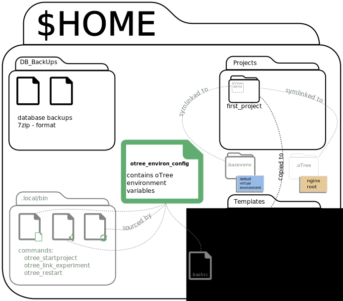

=====
Usage
=====

.. _general_usage:

General usage
-------------

``ovmm`` is a complement to the **oTree Virtual Machine Image** provided by
Felix Albrecht and Holger Gerhardt. Therefore, until now it is only tested on
this specific image. But, we do provide information (:ref:`othersystems`) on
how to create a similar image which can use ``ovmm``.

Always run ``ovmm`` with ``sudo`` or some commands might not work.

If you need more information on the commands, run ``ovmm --help``

.. _first_run:

First run
---------

#. When using ``ovmm`` for the first time, run ``sudo ovmm initialise`` to
   configure your system.

    .. note:: The process leads you through the installation of required
              dependecies and creates necessary content files for ``ovmm``.

              #. Enter administrator's password.
              #. Enter account information of the PostgreSQL superuser.

                 By default, the superuser for a PostgreSQL database is called
                 ``postgres``. You also have to set a password for this
                 account. This password can be new and will be set to the user
                 by request.

#. After running the command, there is a folder called
   ``/home/<user>/ovmm_sources/`` which contains ``ovmm_conf.yml``.
   Perform the following checks:

    #. Check whether the login information for the PostgreSQL database is
       correctly set.
    #. Define the ranges of port numbers, e.g. ``OVMM_DAPHNE_RANGE``. Port
       ranges are stored in lists. Insert distinct values or use list
       comprehension for bigger ranges.

#. Next, go back to your home folder. You should see a file called
   ``nginx_template``. Read the commentary to adjust the file to your network
   configuration.

   This file will be reused every time a new user is created. The process will
   fill out the user specific values and place it under
   ``/etc/nginx/sites-avalaible``. Then, a symlink will link this file to
   ``/etc/nginx/sites-enabled``, so that `Nginx`_ takes care of it.

   .. _Nginx: https://nginx.org/en/

#. Forelast, try out one of the innocent lookup commands like
   ``sudo ovmm count_user`` or ``list_user``. If they succeed, you have
   correctly set up ``ovmm``.

#. Last, set up a test account and verify whether everything is working
   including *oTree* by running one of the example experiments.

.. _command_line_options:

Command line options
--------------------

Command line options are entered used with ``sudo ovmm <command>``

.. _commands:

Commands
~~~~~~~~

Since command expansion is implemented, the commands after the forward slash
are also available.

initialise / i
    Adjust your system to the needs of ``ovmm``. It installs Ubuntu
    dependencies as well as configuration files for the Administrator.

    .. warning::
        #. This command should be executed on first run in advance of any other
           command.
        #. An internet connection is needed

add_user / a
    Add a new user to the configuration. Several prompts will ask you about
    user specific information. Please, fill out the forms in accordance with
    the provided examples.

delete_user / d
    Delete a user from the configuration. Her account including her home
    folder is completely removed. Make sure you have a backup of all files in
    advance.

backup_user / b
    Create a backup for a given user and save it in the
    administrator's home directory under
    ``/home/<admin>/ovmm_sources/user_backups``. Choose from one of three
    options, ``all``, ``db``, ``home``, whether you want to make a backup of
    the database or the home folder. ``all`` is a shortcut to run a backup of
    both, database and home folder.

count_user / c
    Return the number of existing accounts and the number of possible,
    additional accounts.

list_user / l
    Give a list of user names of all currently installed users.

.. _end_user_commands:

End User Commands
-----------------

Apart from the standard otree commands, the user has the following commands
at hand:

* ``otree_startproject`` creates an otree project in the folder `Projects` in
  the user's home directory. The created folder is a basic otree project folder
  WITHOUT the example apps. It further creates either a symbolic link ``venv``
  to the default virtual python environment of the user in the project folder
  or creates a specific virtual environment within the project folder called
  ``venv``. The latter allows for specialized oTree versions for each project.
  Lastly it copies the `_rooms` directory from the folder Templates into the
  project folder. `_rooms` contains a preconfigured econ101.txt for 24 clients.

* ``otree_link_experiment`` is used to create a symbolic link to the nginx root
  location. The nginx webserver looks in a predefined location for a webserver
  root. The command handles the linking for you and creates a symlink to
  ``$HOME/.oTree`` which is where nginx looks for your project.

* ``otree_restart`` helps you with your starting requirements. It offer to run
  ``otree collectstatic`` for you  as well as an ``otree resetdb``. Before the
  database reset is executed pg_dump makes a backup of the current state of the
  database and stores a 7zipped version of it in $HOME/DB_BackUps. Finally it
  runs ``otree runprodserver --port=YOUR_DAPHNE_PORT`` for you to ensure that
  you use the correct port. ``otree_restart`` also comes with a number of
  arguments that help you get started more quickly.

:-c: run ``otree collectstatic``
:-h: help
:-m: Send emails when otree stops running.
   (Your email is configured in `otree_environ_config`.)
:-p: skip queries and run ``otree runprodserver --port=YOUR_PORT`` directly
:-r: run ``otree resetdb``
:-s: start otree in a detached screen (virtual console)

The commands are stored in $HOME/.local/bin for each user separately so that
users can make adjustments for themselves if needed.

All three commands offer a console and a GUI based on GTK zenity dialogs.
For calling the GUI three ``*.desktop`` are created in $HOME/Desktop.

When you call up a command the command will guide you through the process.

The below graphic provides an overview of the file structure created in the
oTree user's home directory and the command relations.

The user should not run ``otree runserver`` (which is just for local testing)
or ``otree runprodserver`` (because of the proxy settings).

.. _running_experiments:

Running Experiments as End User
-------------------------------

As End User you have to follow the following steps in order to run
experiments.

1. Execute ``otree_restart``

2. Choose whether to do a collect static or not.

3. Choose whether to do a database reset.

4. Watch the output if everything starts fine. ;-)

If you have trouble starting the experiment or you want to activate demo mode
change the necessary parameters in the ``otree_environ_config``.
``otree_restart`` sources ``otree_environ_config`` each time it is called. You
don't need to manually source it to activate the new settings.

